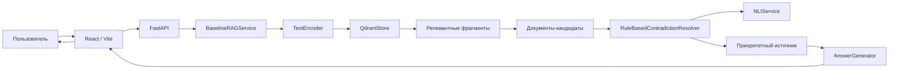

# Модуль анализа и разрешения противоречий в информационных источниках для интеллектуального чат-бота

Интеллектуальный чат-бот для поиска информации по корпусу документов и анализа противоречий между источниками. Система использует векторный поиск, метаданные документов и отдельный модуль анализа отношений между источниками для выбора приоритетного документа и формирования ответа.

Проект разработан в рамках выпускной квалификационной работы по направлению 09.03.02 «Информационные системы и технологии».

## О проекте

Основная проблема проекта — ситуация, когда несколько информационных источников могут быть релевантны одному пользовательскому вопросу, но отличаться по содержанию, версии, актуальности или степени приоритета.

Обычный векторный поиск позволяет найти похожие по смыслу фрагменты, но не решает задачу выбора источника при наличии нескольких вариантов. Поэтому в проекте реализован дополнительный этап анализа найденных документов.

Основная идея системы:

1. пользователь задаёт вопрос;
2. система выполняет семантический поиск по корпусу;
3. найденные фрагменты группируются по исходным документам;
4. документы анализируются с учётом содержания и метаданных;
5. определяется отношение между источниками;
6. выбирается приоритетный источник;
7. подготовленный контекст передаётся компоненту формирования ответа.

Корпус документов ориентирован на предметную область расстройств аутистического спектра и включает официальные, вторичные и синтетические источники.

Для документов используются метаданные, в том числе:

* идентификатор документа;
* тематическое семейство;
* тип источника;
* версия;
* период действия;
* актуальность;
* приоритет источника.

Эти признаки используются при поиске и при разрешении противоречий.

## Основные возможности

### Семантический поиск

Пользовательский вопрос преобразуется в векторное представление, после чего выполняется поиск релевантных фрагментов в Qdrant.

### Работа с корпусом документов

Документы проходят подготовку, разбиваются на фрагменты, для которых формируются векторные представления и сохраняются метаданные.

### Группировка результатов по документам

Найденные фрагменты рассматриваются не только независимо, но и в контексте исходных документов. Это позволяет перейти от поиска отдельных текстовых фрагментов к анализу источников.

### Анализ отношений между источниками

Модуль анализа определяет, могут ли найденные документы сопоставляться в рамках текущего вопроса, и устанавливает отношение между ними.

Для предварительной оценки лексического пересечения используется коэффициент Жаккара. Он показывает степень пересечения множеств значимых токенов двух документов.

### Выбор приоритетного источника

При выборе источника учитываются не только результаты поиска, но и характеристики документа: тип источника, версия, актуальность и приоритет.

### Дополнительная смысловая проверка

В разработанной конфигурации используется `NLIService`, выполняющий дополнительную проверку смыслового отношения между утверждениями. Результат используется как дополнительный признак при анализе источников.

### Формирование ответа

После анализа найденных источников система формирует документную основу ответа и передаёт её компоненту генерации ответа.

### Пользовательский интерфейс

Клиентская часть позволяет отправить вопрос и получить результат анализа, включая итоговый ответ и информацию о найденных источниках.

## Технологический стек

### Backend

* Python
* FastAPI

### Векторное хранилище

* Qdrant

Qdrant используется для хранения векторных представлений фрагментов документов и выполнения семантического поиска с использованием метаданных.

### Векторные представления

* Sentence Transformers / модель построения эмбеддингов

`TextEncoder` отвечает за построение векторных представлений пользовательских запросов и документов.

### Анализ отношений

* правиловой модуль анализа;
* NLI-модель для дополнительной смысловой проверки.

### Frontend

* React
* Vite

Клиентская часть используется для взаимодействия пользователя с серверным приложением и отображения результатов.

### Генерация ответа

* языковая модель через компонент формирования ответа.

Точная модель и параметры подключения: `[нужно уточнить]`.

## Архитектура

Система построена как набор взаимодействующих компонентов с разделением ответственности между поиском, хранением данных, анализом источников и пользовательским интерфейсом.

Основные компоненты:

* пользовательский интерфейс;
* серверное приложение;
* модуль подготовки корпуса;
* `TextEncoder`;
* `QdrantStore`;
* `BaselineRAGService`;
* `RuleBasedContradictionResolver`;
* `NLIService`;
* `AnswerGenerator`;
* подсистема оценки качества.

Основная бизнес-логика анализа источников сосредоточена в `RuleBasedContradictionResolver`, а `BaselineRAGService` координирует общий сценарий обработки запроса.



## Как работает проект

Основной сценарий обработки пользовательского вопроса:

1. Пользователь вводит вопрос в веб-интерфейсе.
2. Клиентское приложение отправляет запрос серверному приложению.
3. `BaselineRAGService` запускает обработку запроса.
4. `TextEncoder` формирует векторное представление запроса.
5. `QdrantStore` выполняет поиск релевантных фрагментов.
6. Найденные фрагменты группируются по исходным документам.
7. Формируются документы-кандидаты для дальнейшего анализа.
8. `RuleBasedContradictionResolver` проверяет сопоставимость источников и анализирует их отношения.
9. При необходимости выполняется дополнительная смысловая проверка через `NLIService`.
10. Система выбирает приоритетный источник с учётом метаданных.
11. `AnswerGenerator` формирует контекст для ответа.
12. Результат возвращается в пользовательский интерфейс.

## Самая технически сложная часть

Наиболее существенной частью проекта является не сам векторный поиск, а переход от поиска релевантных фрагментов к **анализу и разрешению противоречий между документами**.

### Проблема

Два документа могут быть одинаково релевантны пользовательскому вопросу, но иметь разный статус, версию или актуальность. Поэтому выбор только по степени семантической близости недостаточен.

### Решение

В проекте реализован отдельный `RuleBasedContradictionResolver`, который работает после поиска.

Он использует:

* содержание найденных документов;
* тематическое соответствие;
* тип источника;
* версию;
* актуальность;
* приоритет источника;
* результаты дополнительной смысловой проверки.

При лексическом сопоставлении документов может использоваться коэффициент Жаккара:

```text
J(A,B) = |A ∩ B| / |A ∪ B|
```

Он применяется как признак лексической близости, а не как самостоятельное доказательство противоречия.

### Дополнительная смысловая проверка

Правиловой анализ не всегда достаточен для определения отношения между двумя утверждениями. Поэтому в разработанной конфигурации используется `NLIService`.

В результате получается последовательность:

```text
поиск
  ↓
фрагменты
  ↓
документы-кандидаты
  ↓
правиловой анализ
  ↓
NLI-проверка
  ↓
выбор приоритетного источника
  ↓
формирование ответа
```

### Основные компоненты кода

`BaselineRAGService` — координирует общий процесс обработки запроса.

`QdrantStore` — отвечает за работу с векторным хранилищем.

`TextEncoder` — формирует векторные представления.

`RuleBasedContradictionResolver` — реализует основную логику анализа отношений и выбора приоритетного источника.

`NLIService` — выполняет дополнительную смысловую проверку.

`AnswerGenerator` — формирует данные для итогового ответа.

## Структура проекта

Точная структура каталогов репозитория в доступном контексте не сохранена, поэтому дерево файлов намеренно не приводится, чтобы не создавать вымышленную структуру.

Основные программные компоненты проекта:

```text
Backend
├── BaselineRAGService
├── QdrantStore
├── TextEncoder
├── RuleBasedContradictionResolver
├── NLIService
└── AnswerGenerator

Frontend
└── React / Vite application
```

Фактические названия каталогов и файлов: `[нужно уточнить по репозиторию]`.

## Требования и зависимости

Для работы проекта необходимы:

* Python;
* Node.js;
* Qdrant;
* зависимости Python-проекта;
* зависимости React/Vite;
* используемая модель эмбеддингов;
* NLI-модель;
* доступ к используемой языковой модели, если она запускается как внешний сервис.

Точные версии Python, Node.js и используемых моделей: `[нужно уточнить]`.

## Установка и запуск

### 1. Клонирование репозитория

```bash
git clone [URL_REPOSITORY]
cd [PROJECT_DIRECTORY]
```

### 2. Установка зависимостей backend

```bash
pip install -r requirements.txt
```

### 3. Установка зависимостей frontend

```bash
npm install
```

### 4. Запуск Qdrant

Необходим запущенный экземпляр Qdrant.

Конкретная команда запуска в текущем контексте не зафиксирована:

```text
[нужно указать способ запуска Qdrant]
```

### 5. Подготовка и индексация корпуса

Перед использованием системы необходимо подготовить корпус документов и выполнить его индексацию.

Конкретная команда индексации:

```text
[нужно указать команду индексации]
```

### 6. Запуск backend

Используется FastAPI.

Команда запуска:

```text
[нужно указать фактическую команду запуска FastAPI]
```

### 7. Запуск frontend

Для клиентской части используется React/Vite.

Команда запуска:

```bash
npm run dev
```

Адрес приложения:

```text
[нужно указать фактический адрес]
```

## Демонстрация проекта

Для короткой демонстрации проекта рекомендуется показать один законченный сценарий.

### 1. Первые 20–30 секунд

Показать запущенный веб-интерфейс и кратко объяснить:

* пользователь задаёт вопрос;
* система ищет информацию в корпусе;
* дополнительно анализирует найденные источники.

### 2. Основной сценарий

Ввести заранее подготовленный вопрос, для которого в корпусе есть несколько релевантных источников.

Показать:

* пользовательский запрос;
* найденные источники;
* результаты анализа;
* выбранный приоритетный источник;
* итоговый ответ.

### 3. Самая сложная функция

Перейти к `RuleBasedContradictionResolver`.

Показать фрагмент метода, в котором:

* сравниваются документы;
* применяются правила;
* учитываются метаданные;
* определяется приоритетный источник.

Затем показать место взаимодействия с `NLIService`.

### 4. Что объяснить комиссии

Основная мысль демонстрации:

> Поиск релевантного фрагмента не является конечным решением. После поиска система переходит на уровень документов, анализирует отношения между источниками и выбирает документную основу ответа с учётом содержания и метаданных.

## Ограничения

Текущие ограничения проекта:

* корпус документов ограничен по объёму;
* качество результата зависит от полноты и корректности метаданных;
* правиловой анализ не покрывает все возможные типы противоречий;
* результат NLI-проверки зависит от используемой модели;
* качество итогового ответа зависит от используемой языковой модели;
* автоматическое обновление корпуса и источников требует дальнейшего развития системы.

## Возможные улучшения

### Обсуждавшиеся направления

* расширение корпуса документов;
* расширение набора правил анализа;
* улучшение смысловой проверки;
* добавление новых типов источников и метаданных;
* расширение средств диагностики и оценки качества.

### Дополнительные направления

* автоматическое обнаружение изменений в источниках;
* автоматическое обновление версий документов;
* более детальное журналирование решений модуля анализа;
* расширение набора тестовых сценариев;
* более подробная визуализация причин выбора приоритетного источника.

## Результаты разработки

В рамках проекта реализован программный прототип интеллектуального чат-бота, включающий:

* пользовательский интерфейс;
* серверное приложение;
* подготовку и индексацию корпуса;
* векторный поиск;
* хранение документов и метаданных;
* анализ отношений между источниками;
* выбор приоритетного источника;
* дополнительную смысловую проверку;
* формирование ответа;
* экспериментальную оценку разработанной конфигурации.

В экспериментальной оценке доля правильного выбора приоритетного источника увеличилась с `0,3846` для контрольной конфигурации до `0,6154` для разработанной конфигурации с правилами и дополнительной смысловой проверкой.

## Автор

**Рабдел Дмитрий Александрович**

Проект выполнен в рамках выпускной квалификационной работы по направлению 09.03.02 «Информационные системы и технологии».

Период разработки: **2025–2026 гг.**

GitHub / GitLab:

`[нужно добавить ссылку на репозиторий]`

# Что мне нужно уточнить

1. **URL GitHub/GitLab** — если репозиторий уже создан.
2. **Точная структура каталогов и файлов** — чтобы заменить условное дерево реальным.
3. **Точная команда запуска FastAPI**.
4. **Точная команда запуска Qdrant**.
5. **Точная команда подготовки/индексации корпуса**.
6. **Точный адрес frontend после запуска**.
7. **Версии Python и Node.js**, если они зафиксированы в проекте.
8. **Точная используемая NLI-модель**.
9. **Точная используемая языковая модель и способ её подключения**.
10. **Реальная трудоёмкость разработки** — если хочешь указать количество часов/месяцев вместо общего периода.
11. **Фактические названия файлов**, в которых находятся `BaselineRAGService`, `QdrantStore`, `TextEncoder`, `RuleBasedContradictionResolver`, `NLIService` и `AnswerGenerator`.
